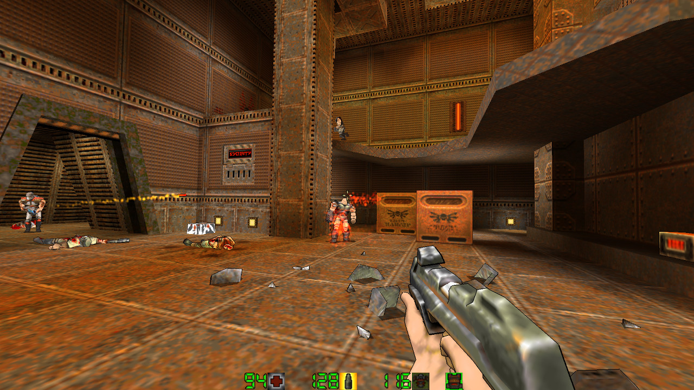

# Quake II Classic Client for GNU/Linux



## Acknowledgement

This repository is a streamlined fork of [jdolan/quake2](https://github.com/jdolan/quake2). It includes only the essential source code, excluding the large `.pack` data file for a more lightweight repository. Credit is due to jdolan for their work, which provided a modern, compilable Linux base that made these fixes and improvements possible.

## Overview

This is a 64-bit client for the classic *[Quake II](http://en.wikipedia.org/wiki/Quake_II)* on GNU/Linux, based on the abandoned AprQ2 project by _maniac_.

## Improvements in this Fork

The primary focus of this fork has been a complete overhaul of the legacy sound system. The original AprQ2 client used an SDL 1.2 implementation prone to instability on modern multi-core systems, leading to frequent freezes, crashes, and sound glitches.

This version introduces a robust, thread-safe sound mixer that resolves these critical issues:
*   Fixed numerous race conditions and deadlocks that caused the game to freeze.
*   Implemented an on-the-fly audio conversion system using SDL. This allows the engine to correctly play mixed 8-bit and 16-bit sound files, restoring previously silent weapon sounds and improving overall audio quality.
*   Ensured stable operation on modern Linux distributions using PulseAudio and PipeWire.

## Downloads

If you do not own the full version of Quake II, you can download the shareware game data (v3.14), which includes the first single-player unit and several multiplayer maps. This is enough to get the game running.

*   [Quake II Shareware Data from http://tastyspleen.net/downloads](http://tastyspleen.net/quake/downloads/)

## Compiling from Source

Successfully compiled on Ubuntu 20.04 LTS and similar distributions.

#### 1. Install Build Tools

First, prepare your system with the essential build tools:

```bash
sudo apt-get install build-essential automake git -y
```

#### 2. Install Dependencies

Next, install the libraries required by the game:

```bash
sudo apt-get install libpng-dev libjpeg-dev libcurl4-gnutls-dev mesa-common-dev libsdl1.2-dev -y
```
_Note: `liblz1` seems to be an incorrect package name and is not required for compilation. It has been removed from the list._

#### 3. Compile the Game

Clone this repository and use `make` to compile the client:

```bash
git clone https://github.com/Fryziu/Q2classic.git
cd Q2classic
make
```

The compiled files will be located in the `bin/` directory.

## Installation and Running

#### 1. Prepare Game Directories

Quake II expects its files to be in a specific location. Create the necessary directories in your home folder:

```bash
mkdir -p ~/.q2classic/baseq2
```

#### 2. Copy Game Binaries

Copy the compiled executable and game library to their respective locations:

```bash
cp bin/q2classic ~/.q2classic/
cp bin/q2game.so ~/.q2classic/baseq2/
```

#### 3. Add Game Data

To play, you need the game data files (`.pak` files).

*   **For the full game:** Copy `pak0.pak` and any other `.pak` files from your retail _Quake II_ installation into your `~/.quake2/baseq2/` directory.
*   **For the demo:** If you downloaded the shareware data, extract it and copy its `.pak` files into `~/.quake2/baseq2/`.

#### 4. Run the Game

Navigate to your `.quake2` directory and execute the game:

```bash
cd ~/.q2classic
./q2classic
```
